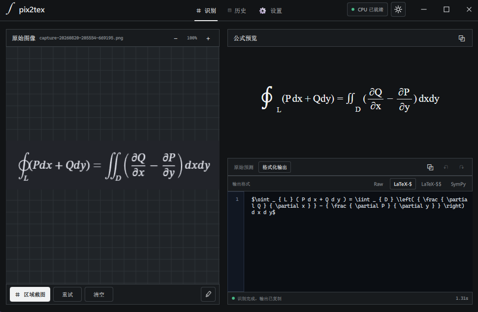
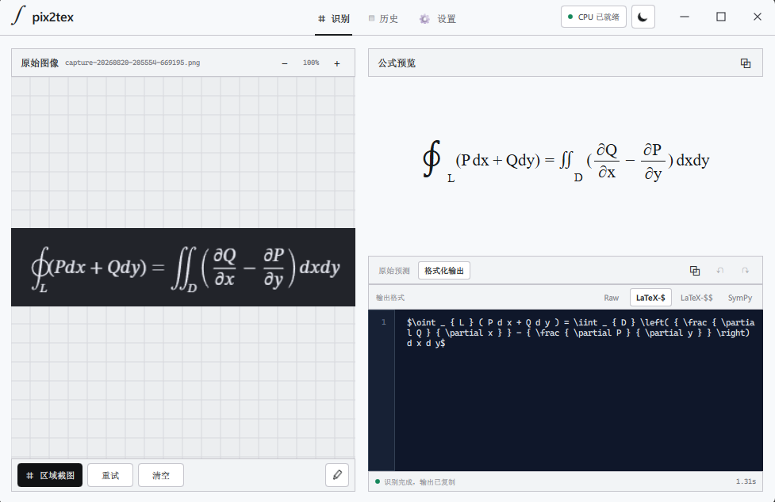

<div align="center">

<h1>∫ pix2tex</h1>

**把截图、图片和手写公式转换成可编辑 LaTeX**

Local-first formula OCR for Windows — private, offline, and CPU-friendly.

[](https://github.com/awwbugbug/pix2tex-studio/releases/tag/v2.0.0-rc1)
[](https://github.com/awwbugbug/pix2tex-studio/releases)
[](#本地优先)
[](LICENSE)

[**下载安装包**](https://github.com/awwbugbug/pix2tex-studio/releases/download/v2.0.0-rc1/Pix2TexStudio-2.0.0-rc1-Setup.exe)
&nbsp;·&nbsp;
[查看 Release](https://github.com/awwbugbug/pix2tex-studio/releases/tag/v2.0.0-rc1)
&nbsp;·&nbsp;
[构建文档](https://github.com/awwbugbug/pix2tex-studio/blob/v2.0.0-rc1/docs/release/BUILD.md)

</div>

## 应用预览

<table>
  <tr>
    <td width="50%"></td>
    <td width="50%"></td>
  </tr>
  <tr>
    <td align="center"><sub>深色主题</sub></td>
    <td align="center"><sub>亮色主题</sub></td>
  </tr>
</table>

截图进入左侧工作区，识别后的公式在右侧即时渲染，同时保留可编辑、可复制的 LaTeX 源码。整个识别过程均在本机完成。

## 为什么是 Pix2Tex Studio

| | 能力 | 说明 |
|---|---|---|
| **⌗** | 多种输入 | 区域截图、打开图片、粘贴、拖放，以及画板手写公式 |
| **∫** | 公式识别 | 基于 CPU 版 UniMERNet，兼顾印刷公式与手写输入 |
| **◫** | 即时预览 | 本地渲染识别结果，长公式也可滚动查看与编辑 |
| **{ }** | 多种输出 | Raw、行内 LaTeX、块级 LaTeX 与 SymPy |
| **↺** | 历史记录 | 本地保存、预览、复制和单条删除，支持数量上限与缓存清理 |
| **◐** | 原生体验 | 亮色／深色／跟随系统主题、全局快捷键、托盘与单实例唤醒 |

## 快速开始

1. 从 [GitHub Release](https://github.com/awwbugbug/pix2tex-studio/releases/tag/v2.0.0-rc1) 下载 Windows 安装包。
2. 安装并启动 `pix2tex`，无需单独配置 Python、Anaconda、CUDA 或模型文件。
3. 点击 **区域截图**，或者直接打开、粘贴、拖入图片；需要手写时切换到画板即可。

> [!NOTE]
> 当前最新公开版本是 `2.0.0rc1` 候选版。与安装包一致的冻结源码位于
> [`v2.0.0-rc1`](https://github.com/awwbugbug/pix2tex-studio/tree/v2.0.0-rc1) 标签。

> [!WARNING]
> Windows 安装包目前未进行 Authenticode 签名，因此 SmartScreen 可能显示“未知发布者”。
> 请从本仓库 Release 下载，并使用随 Release 提供的 `SHA256SUMS.txt` 核对文件完整性。

## 本地优先

- **离线推理**：识别时不依赖云端 API，也不会上传公式截图。
- **自带运行环境**：安装包包含 CPU 推理环境和模型权重。
- **数据留在本机**：设置、历史记录、截图缓存和诊断日志均保存在本地。
- **模型保持热启动**：关闭到托盘后保留工作进程，后续识别无需重复冷启动。

## 技术栈

```text
PySide6 + Qt Quick/QML        原生 Windows 桌面界面
UniMERNet tiny + PyTorch CPU  公式与手写识别
MathJax                       本地 LaTeX 预览
PyInstaller + NSIS            独立运行环境与安装程序
```

应用以紧凑的 `980 × 640` 窗口启动。模型运行在独立 Worker 进程中，冷启动不会阻塞界面；截图、历史记录、系统托盘与全局快捷键由桌面进程统一管理。

## 开发与构建

```powershell
git clone https://github.com/awwbugbug/pix2tex-studio.git
cd pix2tex-studio
git checkout v2.0.0-rc1
```

开发环境、运行时准备、便携版构建和 NSIS 安装包生成请参阅
[`docs/release/BUILD.md`](https://github.com/awwbugbug/pix2tex-studio/blob/v2.0.0-rc1/docs/release/BUILD.md)。

## 版本状态

`2.0.0rc1` 已完成 CPU 独立运行环境、Windows 安装包、离线 Worker、连续识别稳定性、单实例与托盘流程的候选版冻结。它仍标记为 Pre-release：真实输入验收集以及多显示器负坐标截图将由实际使用继续验证。

详细版本说明和已知限制见
[`v2.0.0-rc1 Release`](https://github.com/awwbugbug/pix2tex-studio/releases/tag/v2.0.0-rc1)。

## 开源与致谢

Pix2Tex Studio 的原创应用代码采用 [MIT License](LICENSE)。2.0 识别后端基于
[OpenDataLab UniMERNet](https://github.com/opendatalab/UniMERNet)；1.0 系列基于
[pix2tex / LaTeX-OCR](https://github.com/lukas-blecher/LaTeX-OCR)。项目与上述上游维护者不存在隶属或官方背书关系。

随安装包分发的第三方组件仍适用各自许可证，详情见
[`THIRD_PARTY_NOTICES.md`](THIRD_PARTY_NOTICES.md) 与 `packaging/third-party-licenses/`。
